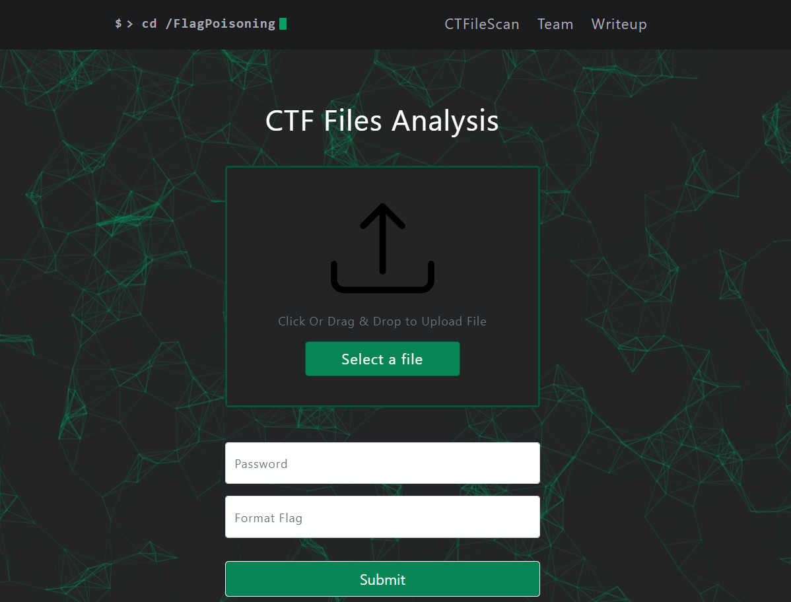

# CTFileScan-WEB
This website is used to scan automatically files during CTF.


## Setup : 

```bash
docker build -t ctfweb .
docker run --rm -it -p 8080:80 ctfweb
```
The Website is available on your local machine on port *8080*

## Home :


## Features :

## All:
  - Binwalk
  - Strings

### Images:
  - Color Palette swapper
  - Steghide extract
  - StegSeek 
  - Stegoveritas
  - LsbFilter
  - OpenStego
  - Outguess
  - Pngcheck
  - LSB Palette swap
  - Stegpy
  - Stegopvd
  - StegoPit
  - Stegolsb Bruteforce
  - Exiftool
  - Zsteg
  - Jsteg
  - StegExpose *(Lsb)*
  - Stegdetect
  - LsbSteg
  - LsbGraph
  - OpenStego
  - Outguess
  - Pngcheck
  - Gif Frame Extractor


### Audio:
  - Dmtf
  - HideMe
  - .Mid steg
  - Spectrogram
  
### Document:
  - Olevba
  - Pdfcrack
  - Pdfparser
  - Stegsnow

### ELF:
  - Strace
  - Ltrace
  - Steg86
  - Radare2

### Other:
  - .Pem/.Pub decoder *(Openssl)*
  - KcPassword decoder
  - Keepass *(Hash+Bruteforce)*
  - KeyChain Bruteforcer *(chainbreaker)*
  - RubberDucky bin decoder
  - ZipInfo / ZipDetails / Hash Zip + Bruteforce zip password

### Network:
  - Tshark *(HttpRequests)* + DNS
  - Pcapkit report
  - Ssldump
  - Rdpcap data & unhexlified data / UDP data
  - Urlsnarf
  
